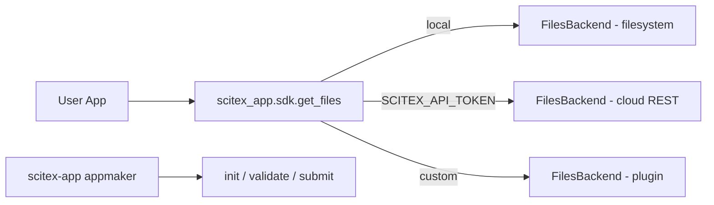

<!-- ---
!-- Timestamp: 2026-03-13
!-- Author: ywatanabe
!-- File: /home/ywatanabe/proj/scitex-app/README.md
!-- --- -->

# SciTeX App (<code>scitex-app</code>)

<p align="center">
  <a href="https://scitex.ai">
    
  </a>
</p>

<p align="center">
  <a href="https://scitex-app.readthedocs.io/">Full Documentation</a> · <code>uv pip install scitex-app[all]</code>
</p>

<!-- scitex-badges:start -->
<p align="center">
  <a href="https://pypi.org/project/scitex-app/"></a>
  <a href="https://pypi.org/project/scitex-app/"></a>
  <a href="https://github.com/ywatanabe1989/scitex-app/actions/workflows/rtd-sphinx-build-on-ubuntu-latest.yml"></a>
</p>
<p align="center">
  <a href="https://github.com/ywatanabe1989/scitex-app/actions/workflows/pytest-matrix-on-ubuntu-py3-11-3-12-3-13.yml"></a>
  <a href="https://codecov.io/gh/ywatanabe1989/scitex-app"></a>
</p>
<!-- scitex-badges:end -->

---

## Problem and Solution

| # | Problem | Solution |
|---|---------|----------|
| 1 | **Every lab reinvents its Django "lab tools" webapp** -- three months of plumbing before the first domain feature ships | **App scaffold** -- `scitex-app init <name>` produces a working Django app with auth, file browser, session logging, routes, manifest |
| 2 | **Apps don't compose** -- each lab's app is a snowflake; can't install B into A's workspace | **FilesBackend plugin registry** -- apps declare a `manifest.json`; `scitex-app dev-install` registers them into any SciTeX Cloud workspace |
| 3 | **Local-vs-cloud storage fork** -- `pathlib` everywhere; cloud integration means rewriting every app | **Auto-backend `get_files(root)`** -- returns a FilesBackend that transparently uses local disk or cloud storage; same read/write API |

## Backends and Operations

| Environment | Backend | How it works |
|-------------|---------|--------------|
| **Local** | `FileSystemBackend` | pathlib-based, zero dependencies |
| **Cloud** | `CloudFilesBackend` | HTTP REST via `SCITEX_API_TOKEN` (injected at runtime) |
| **Custom** | `register_backend()` | S3, GCS, or any storage you need |

<p align="center"><sub><b>Table 1.</b> Three deployment modes. The SDK auto-detects cloud when <code>SCITEX_API_TOKEN</code> is set; otherwise defaults to local filesystem.</sub></p>

Every backend implements the same 7-method protocol:

| Method | Description |
|--------|-------------|
| `read(path)` | Read file content (text or binary) |
| `write(path, content)` | Write content, creating parent dirs |
| `list(directory)` | List files with optional extension filter |
| `exists(path)` | Check if a file exists |
| `delete(path)` | Delete a file |
| `rename(old, new)` | Rename/move a file |
| `copy(src, dest)` | Copy a file |

<p align="center"><sub><b>Table 2.</b> The <code>FilesBackend</code> protocol. Uses <code>typing.Protocol</code> for structural subtyping — backends just implement the methods, no inheritance required.</sub></p>

## Installation

Requires Python >= 3.10. **Zero dependencies** — pure stdlib.

```bash
pip install scitex-app
```

## Architecture

```
src/scitex_app/
├── appmaker/        # scaffold, validate, publish helpers
├── sdk/             # FilesBackend protocol + implementations
├── _cli/            # `scitex-app` Click CLI
├── _mcp/            # MCP server entry
├── _chat/           # AI backend interface
├── _django.py       # ScitexAppConfig base class
├── paths.py         # project path resolution
├── validator.py     # AppValidator (security/privilege)
└── _standalone.py   # umbrella↔standalone bridge
```

## Demo



## Quickstart

```python
from scitex_app.sdk import get_files

# Local filesystem (default)
files = get_files("./my_project")
content = files.read("config/settings.yaml")
files.write("output/result.csv", csv_text)

# List files with filter
yaml_files = files.list("config", extensions=[".yaml"])

# Cloud mode (auto-detected via SCITEX_API_TOKEN)
import os
os.environ["SCITEX_API_TOKEN"] = "your-token"
cloud_files = get_files()  # routes through cloud REST API
```

## Three Interfaces

<details open>
<summary><strong>Python API</strong></summary>

<br>

```python
from scitex_app.sdk import get_files, register_backend, FilesBackend

files = get_files("./project")        # auto-detect backend
files.read("data.csv")                # read file
files.write("out.txt", "hello")       # write file
files.list(extensions=[".yaml"])       # list with filter
files.exists("config.yaml")           # check existence
files.delete("temp.txt")              # delete file
files.rename("old.txt", "new.txt")    # rename/move
files.copy("src.txt", "dst.txt")      # copy file
```

> **[Full API reference](https://scitex-app.readthedocs.io/en/latest/api/scitex_app.html)**

</details>

<details>
<summary><strong>CLI Commands</strong></summary>

<br>

```bash
scitex-app --help-recursive              # Show all commands
scitex-app read <path>                   # Read a file
scitex-app write <path> "content"        # Write to a file
scitex-app list [directory]              # List files
scitex-app exists <path>                 # Check existence
scitex-app delete <path>                 # Delete a file
scitex-app rename <old> <new>            # Rename/move a file
scitex-app copy <src> <dest>             # Copy a file
scitex-app list-python-apis              # List Python API tree
scitex-app mcp list-tools                # List MCP tools
```

All file commands support `--json` output. Destructive commands support `--dry-run`.

> **[Full CLI reference](https://scitex-app.readthedocs.io/en/latest/quickstart.html)**

</details>

<details>
<summary><strong>MCP Server — for AI Agents</strong></summary>

<br>

AI agents can read, write, and manage files through the unified SDK.

| Tool | Description |
|------|-------------|
| `app_read_file` | Read a file through the SDK backend |
| `app_write_file` | Write content to a file |
| `app_list_files` | List files in a directory |
| `app_file_exists` | Check if a file exists |
| `app_delete_file` | Delete a file |
| `app_copy_file` | Copy a file |
| `app_rename_file` | Rename/move a file |

<sub><b>Table 3.</b> Seven MCP tools mirroring the FilesBackend protocol. All tools accept JSON parameters and return JSON results.</sub>

```bash
scitex-app mcp start
```

> **[Full MCP specification](https://scitex-app.readthedocs.io/en/latest/api/scitex_app._mcp.html)**

</details>

## App Development CLI

Create, validate, and publish SciTeX apps — no platform installation required.

```bash
# Scaffold a new app
scitex-app app init . --name my_cool_app

# Validate before submission
scitex-app app validate .

# Dev-install on your SciTeX Cloud server
scitex-app app install-dev . --server http://127.0.0.1:8000

# Submit for public review
scitex-app app submit .
```

Also available via the main CLI: `scitex app init`, `scitex app validate`, etc.

## Role in SciTeX Ecosystem

`scitex-app` is the **complete toolkit for app developers** — runtime SDK + development CLI. It provides backend-agnostic interfaces that let apps work locally, on the cloud, or self-hosted without code changes.

```
scitex (orchestrator, core compute, CLI, MCP)
  |-- scitex-app (this package) -- app SDK + development CLI
  |     |-- appmaker            -- scaffold, validate, publish
  |     |-- ScitexAppConfig     -- Django base class for app integration
  |     |-- AppValidator        -- security/privilege checking
  |     |-- FilesBackend        -- unified file I/O protocol
  |     |-- paths               -- project path resolution
  |     +-- chat                -- AI backend interface
  |-- scitex-ui                 -- React/TS component library
  +-- figrecipe                 -- reference app (figures)
```

**What this package owns:**

- App scaffolding, validation, and submission (`scitex-app app init/validate/submit`)
- Dev-install workflow (`scitex-app app dev-install`)
- `FilesBackend` protocol and implementations (filesystem, cloud, custom)
- `ScitexAppConfig` Django base class (`from scitex_app.embed import ScitexAppConfig`)
- `AppValidator` for security and privilege checking
- Path resolution utilities for project/workspace discovery

**What this package does NOT own:**

- Frontend components -- see [scitex-ui](https://github.com/ywatanabe1989/scitex-ui)
- Platform server APIs -- see [scitex-hub](https://github.com/ywatanabe1989/scitex-hub)
- Core compute (io, stats, plt) -- see [scitex](https://github.com/ywatanabe1989/scitex-python)

## Part of SciTeX

`scitex-app` is part of [**SciTeX**](https://scitex.ai). Install via
the umbrella with `pip install scitex[app]` to use as
`scitex.app` (Python) or `scitex app ...` (CLI).

```python
import scitex

# Access files through the unified SDK
files = scitex.app.get_files("./project")
content = files.read("recipes/scatter.yaml")
files.write("output/figure.png", png_bytes)
```

Apps built with `scitex-app` work in all three modes:
- **Standalone**: `pip install figrecipe` runs locally with filesystem backend
- **Cloud**: Deploy to scitex.ai — cloud backend injected automatically
- **Self-hosted**: Run your own instance with custom backends

The SciTeX system follows the Four Freedoms for Research below, inspired by [the Free Software Definition](https://www.gnu.org/philosophy/free-sw.en.html):

>Four Freedoms for Research
>
>0. The freedom to **run** your research anywhere — your machine, your terms.
>1. The freedom to **study** how every step works — from raw data to final manuscript.
>2. The freedom to **redistribute** your workflows, not just your papers.
>3. The freedom to **modify** any module and share improvements with the community.
>
>AGPL-3.0 — because we believe research infrastructure deserves the same freedoms as the software it runs on.

---

<p align="center">
  <a href="https://scitex.ai" target="_blank"></a>
</p>

<!-- EOF -->
